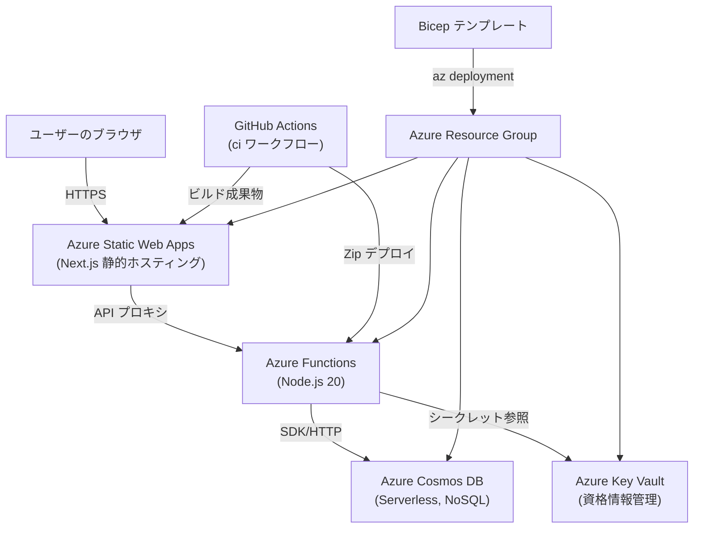

# 瞬間英作文トレーニング Web アプリ

CEFR レベルとトピックで練習カードを切り替えながら瞬間英作文をトレーニングする学習アプリです。ホワイト基調のモバイルファースト UI に刷新し、Swipe 操作で軽快にカード学習が進むようにしました。Next.js をフロントエンドに、Azure Functions + Cosmos DB をバックエンドに採用しています。将来的には Azure OpenAI との連携も検討しています。

## アーキテクチャ概要

- **フロントエンド**: Next.js 14 (App Router) + Tailwind CSS。静的エクスポートして Azure Static Web Apps にホスト。
- **状態管理 / データ取得**: Zustand によるローカル学習履歴の永続化、SWR による API フェッチ。
- **バックエンド**: Azure Functions (Node.js 20)。カード取得 (`GetCards`) とレビュー記録 (`MarkCard`) を提供。
- **データストア**: Azure Cosmos DB Serverless。学習カードとレビュー履歴を保存。
- **インフラ**: Bicep で Static Web App、Function App、Cosmos DB、Storage、Key Vault を一括デプロイ。
- **CI/CD**: GitHub Actions でビルド・静的エクスポート・Functions パッケージを Static Web App にアップロード。

## アーキテクチャ構成図



## ディレクトリ構成

```
.
├── src/
│   ├── app/               # Next.js App Router ページとグローバルスタイル
│   ├── components/        # DeckExperience, FlashCard, DeckFilters など UI コンポーネント
│   ├── lib/               # 型定義・定数・API ヘルパー
│   └── state/             # Zustand ストア
├── api/                   # Azure Functions (GetCards, MarkCard)
├── infra/                 # Bicep テンプレート
├── .github/workflows/     # GitHub Actions 定義
└── staticwebapp.config.json
```

## セットアップ

### 1. 依存関係のインストール

```bash
npm install
npm install --prefix api
```

### 2. 開発サーバーの起動

```bash
# フロントエンド (http://localhost:3000)
npm run dev

# Azure Functions (http://localhost:7071)
cd api
func start
```

`local.settings.json` に Cosmos DB のエンドポイント・キーを設定すると、本番と同じデータソースを利用できます。未設定の場合はサンプルカードが返ります。

### 3. 静的エクスポート

```bash
npm run build:static
```

`out/` に生成されたファイルを Static Web Apps へアップロードします。

## Azure へのデプロイ

1. リソースグループを作成:
   ```bash
   az group create --name iec-rg --location japaneast
   ```
2. Bicep テンプレートをデプロイ:
   ```bash
   az deployment group create \
     --resource-group iec-rg \
     --template-file infra/main.bicep \
     --parameters namePrefix=iec environment=dev
   ```
3. Static Web App のデプロイ トークンを取得し、GitHub Secrets `AZURE_STATIC_WEB_APPS_API_TOKEN` に設定。
4. `main` ブランチへ push すると GitHub Actions (`ci`) がビルドとデプロイを実行。

## ライセンス

© 2025 Jun Nammoku. All rights reserved.
