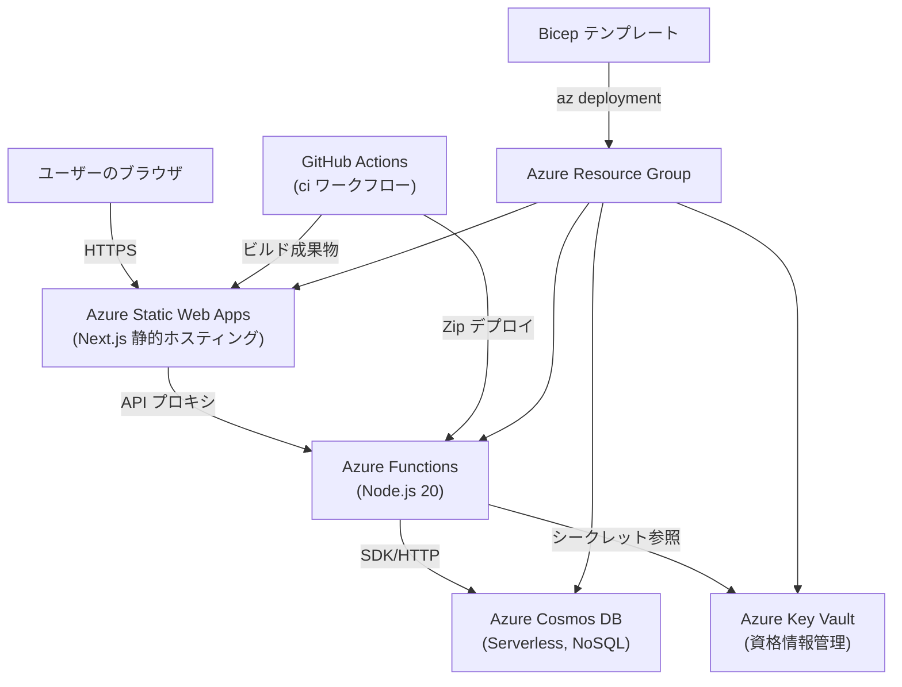

# SpeedSpeak — 瞬間英作文トレーニング

> **https://speedspeak.jp**

日本語の文を見て瞬時に英語に変換する「瞬間英作文」メソッドに基づいた Web トレーニングアプリです。  
CEFR A1〜C2 の **2,200 問以上**を収録し、26 カテゴリのトピックから自由に選んで学習できます。

### 主な機能

- スワイプ操作で正解 / 復習を振り分けるカード学習 UI
- CEFR レベル × トピックで自由にフィルタリング
- AI 辞書機能 — カード内の単語をタップして意味・解説を確認
- お気に入り例文の保存
- セッション結果のサマリー表示
- モバイルファースト・PWA 対応

## アーキテクチャ概要

| レイヤー | 技術 |
|---|---|
| **フロントエンド** | Next.js 14 (App Router) + Tailwind CSS — 静的エクスポート → Azure Static Web Apps |
| **状態管理** | Zustand (ローカル学習履歴の永続化) |
| **バックエンド** | Azure Functions (Node.js 20) — `GetCards`, `MarkCard`, `LookupVocabularyAI` |
| **データストア** | Azure Cosmos DB Serverless (cards + review history) |
| **辞書機能** | Azure OpenAI GPT-4o-mini + Cosmos DB キャッシュ |
| **カード生成** | Azure OpenAI GPT-4o-mini (`scripts/generate-cards.mjs`) |
| **インフラ** | Bicep (Static Web App, Function App, Cosmos DB, Key Vault) |
| **CI/CD** | GitHub Actions → Azure Static Web Apps deploy |

## アーキテクチャ構成図


```mermaid
graph TD
   UserBrowser["ユーザーのブラウザ"] -->|HTTPS| StaticWebApp["Azure Static Web Apps\n(Next.js 静的ホスティング)"]
   StaticWebApp -->|API プロキシ| FunctionApp["Azure Functions\n(Node.js 20)"]
   FunctionApp -->|SDK/HTTP| CosmosDB["Azure Cosmos DB\n(Serverless, NoSQL)"]
   FunctionApp -->|シークレット参照| KeyVault["Azure Key Vault\n(資格情報管理)"]
   GitHubActions["GitHub Actions\n(ci ワークフロー)"] -->|ビルド成果物| StaticWebApp
   GitHubActions -->|Zip デプロイ| FunctionApp
   BicepTemplates["Bicep テンプレート"] -->|az deployment| AzureResources["Azure Resource Group"]
   AzureResources --> StaticWebApp
   AzureResources --> FunctionApp
   AzureResources --> CosmosDB
   AzureResources --> KeyVault
```

## ディレクトリ構成

```
.
├── src/
│   ├── app/               # Next.js App Router ページ (/, /about, /cefr, /privacy, /terms)
│   ├── components/        # DeckExperience, FlashCard, DeckFilters, VocabularyTooltip など
│   ├── lib/               # 型定義・定数・API ヘルパー・CEFR 定義
│   └── state/             # Zustand ストア (deck, favorites)
├── api/                   # Azure Functions (GetCards, MarkCard, LookupVocabularyAI)
│   └── shared/            # Cosmos DB client, customCards.json (2,200+ cards)
├── scripts/               # カード生成・アップロード・品質監査
├── infra/                 # Bicep テンプレート
├── public/                # robots.txt, sitemap.xml, PWA icons, ads.txt
├── .github/workflows/     # GitHub Actions 定義
└── staticwebapp.config.json
```

## セットアップ

### 1. 依存関係のインストール

```bash
npm install
npm install --prefix api
```

### 2. ローカル開発

開発時は 2 つのプロセスを起動します。Next.js dev サーバーが `/api/*` を Azure Functions (port 7071) へ自動プロキシします。

```bash
# ターミナル 1: Azure Functions
cd api && func start

# ターミナル 2: Next.js dev server (port 3000)
npm run dev
```

`api/local.settings.json` に Cosmos DB のエンドポイント・キーを設定すると本番データを利用できます。未設定の場合は `customCards.json` のフォールバックカードが返ります。

### 3. 本番ビルド（静的エクスポート）

```bash
npm run build:static
```

`out/` に生成されたファイルが Azure Static Web Apps へデプロイされます。

### 4. カード生成（オプション）

Azure OpenAI を使って新しいカードを生成できます。`.env` に認証情報を設定してください。

```bash
# 例: A2 レベルの food タグで 20 枚生成
npm run generate:cards -- --level A2 --tags food --count 20

# ローカル JSON に追記
npm run upload:cards -- --local
```

## Azure へのデプロイ

1. リソースグループを作成:
   ```bash
   az group create --name iec-rg --location japaneast
   ```
2. Bicep テンプレートをデプロイ:
   ```bash
   az deployment group create \
     --resource-group iec-rg \
     --template-file infra/main.bicep \
     --parameters namePrefix=iec environment=dev
   ```
3. Static Web App のデプロイ トークンを取得し、GitHub Secrets `AZURE_STATIC_WEB_APPS_API_TOKEN` に設定。
4. `main` ブランチへ push すると GitHub Actions (`ci`) がビルドとデプロイを実行。

## ライセンス

© 2026 Jun Nammoku. All rights reserved.
